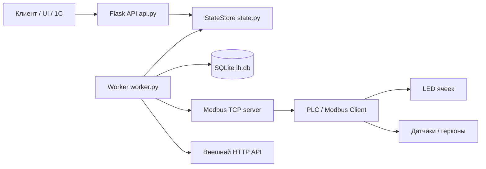
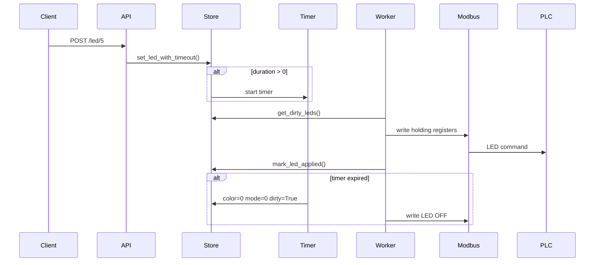
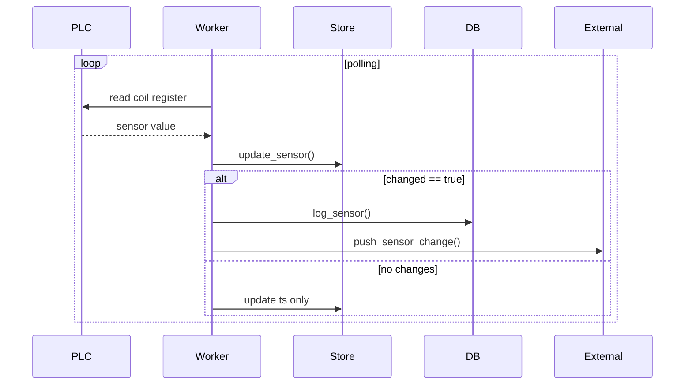

# Архитектура системы интеллектуального хранения

## 1. Назначение системы

Система предназначена для управления ячейками хранения: включения LED-индикации,
опроса датчиков/герконов, записи истории в SQLite и отправки событий во внешнюю систему.

## 2. Общая архитектура



## 3. Основные компоненты

| Компонент | Файл             | Роль                                                                          |
| ------------------ | -------------------- | --------------------------------------------------------------------------------- |
| Flask API          | `api.py`           | Принимает команды на LED и отдаёт состояние     |
| StateStore         | `state.py`         | Оперативное состояние LED и датчиков                 |
| Worker             | `worker.py`        | Главный цикл обмена с Modbus и внешним сервером |
| Modbus Server      | `modbus_server.py` | Локальный Modbus TCP сервер                                        |
| SQLite DB          | `db.py`            | История LED и датчиков                                            |
| App Launcher       | `app.py`           | Собирает систему и запускает потоки                |
| Config             | `config.py`        | Адреса, порты, количество ячеек, тайминги       |

`app.py`  собирает всё вместе: создаёт `Database`, `StateStore`, `ModbusLocalWrapper`, запускает поток Modbus-сервера, поток worker и потом Flask API.

## 4. Источник истины

Система разделяет:

- оперативное состояние;
- историю;
- физический обмен;
- API уровень.

### StateStore

`StateStore` является основным оперативным источником состояния системы.

В `StateStore` хранится:

- текущее состояние LED;
- текущее состояние датчиков;
- dirty-флаги;
- timestamps;
- active LED timers.

`StateStore` хранится в памяти приложения
и используется всеми потоками системы.

### SQLite

SQLite используется только для хранения истории.

База данных не хранит текущее состояние системы.

Таблицы:

| Таблица | Назначение                               |
| -------------- | -------------------------------------------------- |
| sensor_history | История изменения датчиков |
| led_history    | История LED-команд                    |

SQLite используется для:

- аудита;
- логирования;
- диагностики;
- анализа событий.

### Modbus

Modbus является транспортным слоем взаимодействия с PLC.

Holding registers и coil registers
не являются источником истины системы.

Modbus используется только для:

- записи LED-команд;
- чтения датчиков.

### Flask API

Flask API не хранит состояние.

API выполняет:

- приём HTTP-команд;
- чтение snapshot состояния;
- передачу команд в `StateStore`.

API не работает напрямую с Modbus.

### Worker

Worker является единственным компонентом,
который выполняет обмен с оборудованием.

Worker:

- пишет LED в Modbus;
- читает датчики из Modbus;
- пишет историю в SQLite;
- отправляет события наружу.

Это исключает конфликты доступа к оборудованию
между потоками системы.

## 5. Подсистема LED-индикации

Подсистема LED отвечает за управление световой индикацией ячеек хранения.

Основная задача подсистемы:

- включение LED;
- изменение цвета и режима;
- автоматическое выключение по таймеру;
- синхронизация состояния с PLC через Modbus;
- логирование команд LED.

Основной поток работы:

```text
Client/API -> StateStore -> Worker -> Modbus -> PLC -> LED
```

### 5.1 Назначение

Подсистема LED используется для:

* индикации состояния ячеек;
* подсветки нужной ячейки;
* отображения логических состояний;
* временной индикации с автоотключением.

Каждая ячейка имеет:

* цвет;
* режим работы;
* optional timeout.

### 5.2 HTTP API LED

Управление LED выполняется через HTTP API.

Endpoint:

<pre class="overflow-visible! px-0!" data-start="900" data-end="930"><div class="relative w-full mt-4 mb-1"><div class=""><div class="relative"><div class="h-full min-h-0 min-w-0"><div class="h-full min-h-0 min-w-0"><div class="border border-token-border-light border-radius-3xl corner-superellipse/1.1 rounded-3xl"><div class="h-full w-full border-radius-3xl bg-token-bg-elevated-secondary corner-superellipse/1.1 overflow-clip rounded-3xl lxnfua_clipPathFallback"><div class="pointer-events-none absolute inset-x-4 top-12 bottom-4"><div class="pointer-events-none sticky z-40 shrink-0 z-1!"><div class="sticky bg-token-border-light"></div></div></div><div class="relative"><div class=""><div class="relative z-0 flex max-w-full"><div id="code-block-viewer" dir="ltr" class="q9tKkq_viewer cm-editor z-10 light:cm-light dark:cm-light flex h-full w-full flex-col items-stretch ͼd ͼr"><div class="cm-scroller"><pre class="cm-content q9tKkq_readonly m-0"><code><span>POST /led/<bin_no></span></code></pre></div></div></div></div></div></div></div></div></div><div class=""><div class=""></div></div></div></div></div></pre>

Пример запроса:

<pre class="overflow-visible! px-0!" data-start="949" data-end="1008"><div class="relative w-full mt-4 mb-1"><div class=""><div class="relative"><div class="h-full min-h-0 min-w-0"><div class="h-full min-h-0 min-w-0"><div class="border border-token-border-light border-radius-3xl corner-superellipse/1.1 rounded-3xl"><div class="h-full w-full border-radius-3xl bg-token-bg-elevated-secondary corner-superellipse/1.1 overflow-clip rounded-3xl lxnfua_clipPathFallback"><div class="pointer-events-none absolute inset-x-4 top-12 bottom-4"><div class="pointer-events-none sticky z-40 shrink-0 z-1!"><div class="sticky bg-token-border-light"></div></div></div><div class="relative"><div class=""><div class="relative z-0 flex max-w-full"><div id="code-block-viewer" dir="ltr" class="q9tKkq_viewer cm-editor z-10 light:cm-light dark:cm-light flex h-full w-full flex-col items-stretch ͼd ͼr"><div class="cm-scroller"><pre class="cm-content q9tKkq_readonly m-0"><code><span>{</span><br/><span>  "color": </span><span class="ͼj">1</span><span>,</span><br/><span>  "mode": </span><span class="ͼj">1</span><span>,</span><br/><span>  "duration": </span><span class="ͼj">10</span><br/><span>}</span></code></pre></div></div></div></div></div></div></div></div></div><div class=""><div class=""></div></div></div></div></div></pre>

| Поле | Назначение                                        |
| -------- | ----------------------------------------------------------- |
| color    | Цвет LED                                                |
| mode     | Режим работы                                     |
| duration | Время автоотключения в секундах |

Если `duration > 0`,

создаётся таймер автоматического выключения LED.

API не взаимодействует напрямую с Modbus.


### 5.3 Получение состояния ячейки

Endpoint:

GET /bin/<bin_no>

Возвращает текущее состояние датчика и LED указанной ячейки.

Пример ответа:

{
  "status": "ok",
  "bin": 60,
  "sensor": {
    "bin": 60,
    "value": false
  },
  "led": {
    "bin": 60,
    "color": 0,
    "mode": 0
  }
}

Поля ответа:

| Поле     | Назначение              |
| ------------ | --------------------------------- |
| sensor.value | состояние датчика |
| led.color    | текущий цвет LED       |
| led.mode     | текущий режим LED     |

Endpoint предназначен для получения актуального состояния одной ячейки.
Данные возвращаются из StateStore.
API не обращается напрямую к Modbus.

### 5.4 StateStore LED

`StateStore` хранит оперативное состояние LED.

Для каждой ячейки хранится:

| Поле    | Назначение                          |
| ----------- | --------------------------------------------- |
| color       | текущий цвет                       |
| mode        | текущий режим                     |
| dirty       | требуется отправка в Modbus |
| desired_ts  | время установки команды  |
| applied_ts  | время применения               |
| auto_off_ts | время автоотключения       |
| source      | источник команды               |

При установке нового LED:

* состояние обновляется;
* устанавливается `dirty=True`;
* worker позже применяет изменения в Modbus.

### 5.5 Timer auto-off

Если LED установлен с `duration`,

`StateStore` создаёт `threading.Timer`.

После истечения времени:

* LED переводится в:
* `color=0`
* `mode=0`
* устанавливается `dirty=True`;
* worker отправляет выключение в Modbus.

Таймер не работает напрямую с Modbus.

Таймер работает только через изменение состояния в `StateStore`.

### 5.6 Worker обработка LED

Worker циклически проверяет:

<pre class="overflow-visible! px-0!" data-start="2174" data-end="2210"><div class="relative w-full mt-4 mb-1"><div class=""><div class="relative"><div class="h-full min-h-0 min-w-0"><div class="h-full min-h-0 min-w-0"><div class="border border-token-border-light border-radius-3xl corner-superellipse/1.1 rounded-3xl"><div class="h-full w-full border-radius-3xl bg-token-bg-elevated-secondary corner-superellipse/1.1 overflow-clip rounded-3xl lxnfua_clipPathFallback"><div class="pointer-events-none absolute inset-x-4 top-12 bottom-4"><div class="pointer-events-none sticky z-40 shrink-0 z-1!"><div class="sticky bg-token-border-light"></div></div></div><div class="relative"><div class=""><div class="relative z-0 flex max-w-full"><div id="code-block-viewer" dir="ltr" class="q9tKkq_viewer cm-editor z-10 light:cm-light dark:cm-light flex h-full w-full flex-col items-stretch ͼd ͼr"><div class="cm-scroller"><pre class="cm-content q9tKkq_readonly m-0"><code><span class="ͼm">store</span><span class="ͼg">.</span><span>get_dirty_leds()</span></code></pre></div></div></div></div></div></div></div></div></div><div class=""><div class=""></div></div></div></div></div></pre>

Для каждого dirty LED worker:

1. вычисляет Modbus адрес;
2. записывает holding registers;
3. вызывает:
   <pre class="overflow-visible! px-0!" data-start="2319" data-end="2357"><div class="relative w-full mt-4 mb-1"><div class=""><div class="relative"><div class="h-full min-h-0 min-w-0"><div class="h-full min-h-0 min-w-0"><div class="border border-token-border-light border-radius-3xl corner-superellipse/1.1 rounded-3xl"><div class="h-full w-full border-radius-3xl bg-token-bg-elevated-secondary corner-superellipse/1.1 overflow-clip rounded-3xl lxnfua_clipPathFallback"><div class="pointer-events-none absolute inset-x-4 top-12 bottom-4"><div class="pointer-events-none sticky z-40 shrink-0 z-1!"><div class="sticky bg-token-border-light"></div></div></div><div class="relative"><div class=""><div class="relative z-0 flex max-w-full"><div id="code-block-viewer" dir="ltr" class="q9tKkq_viewer cm-editor z-10 light:cm-light dark:cm-light flex h-full w-full flex-col items-stretch ͼd ͼr"><div class="cm-scroller"><pre class="cm-content q9tKkq_readonly m-0"><code><span class="ͼm">mark_led_applied</span><span>()</span></code></pre></div></div></div></div></div></div></div></div></div><div class=""><div class=""></div></div></div></div></div></pre>
4. пишет событие в `led_history`.

Если запись завершилась ошибкой:

* ошибка логируется;
* событие пишется в SQLite;
* dirty-флаг остаётся активным;
* worker повторит попытку позже.

### 5.7 Modbus карта LED

Каждая ячейка занимает 5 holding registers.

Стартовый адрес:

<pre class="overflow-visible! px-0!" data-start="2636" data-end="2686"><div class="relative w-full mt-4 mb-1"><div class=""><div class="relative"><div class="h-full min-h-0 min-w-0"><div class="h-full min-h-0 min-w-0"><div class="border border-token-border-light border-radius-3xl corner-superellipse/1.1 rounded-3xl"><div class="h-full w-full border-radius-3xl bg-token-bg-elevated-secondary corner-superellipse/1.1 overflow-clip rounded-3xl lxnfua_clipPathFallback"><div class="pointer-events-none absolute inset-x-4 top-12 bottom-4"><div class="pointer-events-none sticky z-40 shrink-0 z-1!"><div class="sticky bg-token-border-light"></div></div></div><div class="relative"><div class=""><div class="relative z-0 flex max-w-full"><div id="code-block-viewer" dir="ltr" class="q9tKkq_viewer cm-editor z-10 light:cm-light dark:cm-light flex h-full w-full flex-col items-stretch ͼd ͼr"><div class="cm-scroller"><pre class="cm-content q9tKkq_readonly m-0"><code><span class="ͼm">BASE_ADDR</span><span></span><span class="ͼg">+</span><span> (</span><span class="ͼm">bin_no</span><span></span><span class="ͼg">-</span><span></span><span class="ͼj">1</span><span>) </span><span class="ͼg">*</span><span></span><span class="ͼm">ROW_WIDTH</span></code></pre></div></div></div></div></div></div></div></div></div><div class=""><div class=""></div></div></div></div></div></pre>

Структура блока:

| Offset | Назначение |
| ------ | -------------------- |
| +0     | LedMode              |
| +1     | Color                |
| +2     | MSUColor1            |
| +3     | MSUColor2            |
| +4     | Reserve              |

Пример для bin=1:

| Register | Назначение |
| -------- | -------------------- |
| 10       | mode                 |
| 11       | color                |
| 12       | MSUColor1            |
| 13       | MSUColor2            |
| 14       | reserve              |

### 5.8 Поток LED



## 6. Подсистема датчиков

Подсистема датчиков отвечает за получение состояния ячеек хранения.

Основная задача подсистемы:

- периодический опрос датчиков через Modbus;
- хранение актуального состояния;
- определение изменения состояния;
- запись истории;
- отправка событий во внешнюю систему.

Основной поток работы:

```text
PLC / Coil Registers -> Worker -> StateStore -> SQLite -> External HTTP API
```

### 6.1 Назначение

Подсистема датчиков используется для:

* определения наличия объекта в ячейке;
* контроля изменения состояния ячейки;
* передачи событий во внешнюю систему;
* хранения истории изменений.

Каждый датчик связан с одной ячейкой хранения.


### 6.2 HTTP API Sensor

Получение состояния отдельного датчика:

GET /sensor/<bin_no>

Пример ответа:

{
  "status": "ok",
  "bin": 60,
  "value": false
}

Получение состояния всех датчиков:

GET /sensors

Пример ответа:

{
  "status": "ok",
  "items": {
    "1": true,
    "2": false,
    "3": true
  }
}

Данные возвращаются из StateStore.

API не выполняет прямой опрос Modbus и не взаимодействует с оборудованием.
Актуализация данных выполняется worker-потоком.

### 6.3 Polling

Worker циклически опрашивает все датчики.

Polling выполняется в цикле:

<pre class="overflow-visible! px-0!" data-start="861" data-end="925"><div class="relative w-full mt-4 mb-1"><div class=""><div class="relative"><div class="h-full min-h-0 min-w-0"><div class="h-full min-h-0 min-w-0"><div class="border border-token-border-light border-radius-3xl corner-superellipse/1.1 rounded-3xl"><div class="h-full w-full border-radius-3xl bg-token-bg-elevated-secondary corner-superellipse/1.1 overflow-clip rounded-3xl lxnfua_clipPathFallback"><div class="pointer-events-none absolute inset-x-4 top-12 bottom-4"><div class="pointer-events-none sticky z-40 shrink-0 z-1!"><div class="sticky bg-token-border-light"></div></div></div><div class="relative"><div class=""><div class="relative z-0 flex max-w-full"><div id="code-block-viewer" dir="ltr" class="q9tKkq_viewer cm-editor z-10 light:cm-light dark:cm-light flex h-full w-full flex-col items-stretch ͼd ͼr"><div class="cm-scroller"><pre class="cm-content q9tKkq_readonly m-0"><code><span class="ͼg">for</span><span></span><span class="ͼm">bin_no</span><span></span><span class="ͼg">in</span><span></span><span class="ͼm">range</span><span>(</span><span class="ͼj">1</span><span>, </span><span class="ͼm">bins_count</span><span></span><span class="ͼg">+</span><span></span><span class="ͼj">1</span><span>)</span></code></pre></div></div></div></div></div></div></div></div></div><div class=""><div class=""></div></div></div></div></div></pre>

Интервал опроса:

<pre class="overflow-visible! px-0!" data-start="945" data-end="993"><div class="relative w-full mt-4 mb-1"><div class=""><div class="relative"><div class="h-full min-h-0 min-w-0"><div class="h-full min-h-0 min-w-0"><div class="border border-token-border-light border-radius-3xl corner-superellipse/1.1 rounded-3xl"><div class="h-full w-full border-radius-3xl bg-token-bg-elevated-secondary corner-superellipse/1.1 overflow-clip rounded-3xl lxnfua_clipPathFallback"><div class="pointer-events-none absolute inset-x-4 top-12 bottom-4"><div class="pointer-events-none sticky z-40 shrink-0 z-1!"><div class="sticky bg-token-border-light"></div></div></div><div class="relative"><div class=""><div class="relative z-0 flex max-w-full"><div id="code-block-viewer" dir="ltr" class="q9tKkq_viewer cm-editor z-10 light:cm-light dark:cm-light flex h-full w-full flex-col items-stretch ͼd ͼr"><div class="cm-scroller"><pre class="cm-content q9tKkq_readonly m-0"><code><span class="ͼm">POLL_SENSORS_SEC</span><span></span><span class="ͼg">=</span><span></span><span class="ͼj">0.3</span></code></pre></div></div></div></div></div></div></div></div></div><div class=""><div class=""></div></div></div></div></div></pre>

После завершения полного цикла

worker обновляет:

<pre class="overflow-visible! px-0!" data-start="1045" data-end="1083"><div class="relative w-full mt-4 mb-1"><div class=""><div class="relative"><div class="h-full min-h-0 min-w-0"><div class="h-full min-h-0 min-w-0"><div class="border border-token-border-light border-radius-3xl corner-superellipse/1.1 rounded-3xl"><div class="h-full w-full border-radius-3xl bg-token-bg-elevated-secondary corner-superellipse/1.1 overflow-clip rounded-3xl lxnfua_clipPathFallback"><div class="pointer-events-none absolute inset-x-4 top-12 bottom-4"><div class="pointer-events-none sticky z-40 shrink-0 z-1!"><div class="sticky bg-token-border-light"></div></div></div><div class="relative"><div class=""><div class="relative z-0 flex max-w-full"><div id="code-block-viewer" dir="ltr" class="q9tKkq_viewer cm-editor z-10 light:cm-light dark:cm-light flex h-full w-full flex-col items-stretch ͼd ͼr"><div class="cm-scroller"><pre class="cm-content q9tKkq_readonly m-0"><code><span class="ͼm">last_poll_ts</span></code></pre></div></div></div></div></div></div></div></div></div><div class=""><div class=""></div></div></div></div></div></pre>

Polling выполняется непрерывно

внутри `MODBUS_WORKER`.

### 6.4 Modbus карта датчиков

Каждый датчик соответствует одному coil register.

Адрес вычисляется:

<pre class="overflow-visible! px-0!" data-start="1248" data-end="1317"><div class="relative w-full mt-4 mb-1"><div class=""><div class="relative"><div class="h-full min-h-0 min-w-0"><div class="h-full min-h-0 min-w-0"><div class="border border-token-border-light border-radius-3xl corner-superellipse/1.1 rounded-3xl"><div class="h-full w-full border-radius-3xl bg-token-bg-elevated-secondary corner-superellipse/1.1 overflow-clip rounded-3xl lxnfua_clipPathFallback"><div class="pointer-events-none absolute inset-x-4 top-12 bottom-4"><div class="pointer-events-none sticky z-40 shrink-0 z-1!"><div class="sticky bg-token-border-light"></div></div></div><div class="relative"><div class=""><div class="relative z-0 flex max-w-full"><div id="code-block-viewer" dir="ltr" class="q9tKkq_viewer cm-editor z-10 light:cm-light dark:cm-light flex h-full w-full flex-col items-stretch ͼd ͼr"><div class="cm-scroller"><pre class="cm-content q9tKkq_readonly m-0"><code><span class="ͼm">coil_addr</span><span></span><span class="ͼg">=</span><span></span><span class="ͼm">SENSOR_COIL_BASE</span><span></span><span class="ͼg">+</span><span> (</span><span class="ͼm">bin_no</span><span></span><span class="ͼg">-</span><span></span><span class="ͼj">1</span><span>)</span></code></pre></div></div></div></div></div></div></div></div></div><div class=""><div class=""></div></div></div></div></div></pre>

Пример адресации:

| bin_no | coil address |
| ------ | ------------ |
| 1      | 1000         |
| 2      | 1001         |
| 3      | 1002         |

Worker читает состояние через:

<pre class="overflow-visible! px-0!" data-start="1446" data-end="1498"><div class="relative w-full mt-4 mb-1"><div class=""><div class="relative"><div class="h-full min-h-0 min-w-0"><div class="h-full min-h-0 min-w-0"><div class="border border-token-border-light border-radius-3xl corner-superellipse/1.1 rounded-3xl"><div class="h-full w-full border-radius-3xl bg-token-bg-elevated-secondary corner-superellipse/1.1 overflow-clip rounded-3xl lxnfua_clipPathFallback"><div class="pointer-events-none absolute inset-x-4 top-12 bottom-4"><div class="pointer-events-none sticky z-40 shrink-0 z-1!"><div class="sticky bg-token-border-light"></div></div></div><div class="relative"><div class=""><div class="relative z-0 flex max-w-full"><div id="code-block-viewer" dir="ltr" class="q9tKkq_viewer cm-editor z-10 light:cm-light dark:cm-light flex h-full w-full flex-col items-stretch ͼd ͼr"><div class="cm-scroller"><pre class="cm-content q9tKkq_readonly m-0"><code><span class="ͼm">read_sensor_modbus</span><span>(</span><span class="ͼm">bin_no</span><span>)</span></code></pre></div></div></div></div></div></div></div></div></div></div></div></div></pre>

### 6.5 StateStore Sensor

Текущее состояние датчиков хранится в `StateStore`.

Для каждого датчика хранится:

| Поле   | Назначение                               |
| ---------- | -------------------------------------------------- |
| value      | текущее значение                    |
| ts         | время последнего чтения       |
| changed_ts | время последнего изменения |
| quality    | качество данных                      |

Quality model:

| Quality | Назначение                      |
| ------- | ----------------------------------------- |
| OK      | данные актуальны           |
| STALE   | данные ещё не получены |
| ERROR   | ошибка чтения                 |

После старта системы

все датчики имеют:

<pre class="overflow-visible! px-0!" data-start="1965" data-end="1992"><div class="relative w-full mt-4 mb-1"><div class=""><div class="relative"><div class="h-full min-h-0 min-w-0"><div class="h-full min-h-0 min-w-0"><div class="border border-token-border-light border-radius-3xl corner-superellipse/1.1 rounded-3xl"><div class="h-full w-full border-radius-3xl bg-token-bg-elevated-secondary corner-superellipse/1.1 overflow-clip rounded-3xl lxnfua_clipPathFallback"><div class="pointer-events-none absolute end-1.5 top-1 z-2 md:end-2 md:top-1"></div><div class="relative"><div class="pe-11 pt-3"><div class="relative z-0 flex max-w-full"><div id="code-block-viewer" dir="ltr" class="q9tKkq_viewer cm-editor z-10 light:cm-light dark:cm-light flex h-full w-full flex-col items-stretch ͼd ͼr"><div class="cm-scroller"><pre class="cm-content q9tKkq_readonly m-0"><code><span>quality = STALE</span></code></pre></div></div></div></div></div></div></div></div></div><div class=""><div class=""></div></div></div></div></div></pre>

### 6.6 Changed detection

После чтения датчика worker сравнивает:

* предыдущее значение;
* новое значение.

Если значение изменилось:

<pre class="overflow-visible! px-0!" data-start="2136" data-end="2196"><div class="relative w-full mt-4 mb-1"><div class=""><div class="relative"><div class="h-full min-h-0 min-w-0"><div class="h-full min-h-0 min-w-0"><div class="border border-token-border-light border-radius-3xl corner-superellipse/1.1 rounded-3xl"><div class="h-full w-full border-radius-3xl bg-token-bg-elevated-secondary corner-superellipse/1.1 overflow-clip rounded-3xl lxnfua_clipPathFallback"><div class="pointer-events-none absolute inset-x-4 top-12 bottom-4"><div class="pointer-events-none sticky z-40 shrink-0 z-1!"><div class="sticky bg-token-border-light"></div></div></div><div class="relative"><div class=""><div class="relative z-0 flex max-w-full"><div id="code-block-viewer" dir="ltr" class="q9tKkq_viewer cm-editor z-10 light:cm-light dark:cm-light flex h-full w-full flex-col items-stretch ͼd ͼr"><div class="cm-scroller"><pre class="cm-content q9tKkq_readonly m-0"><code><span class="ͼm">changed</span><span></span><span class="ͼg">=</span><span> (</span><span class="ͼm">new_value</span><span></span><span class="ͼg">!=</span><span></span><span class="ͼm">old_value</span><span>)</span></code></pre></div></div></div></div></div></div></div></div></div><div class=""><div class=""></div></div></div></div></div></pre>

то:

1. обновляется `changed_ts`;
2. состояние записывается в `StateStore`;
3. выполняется запись истории;
4. отправляется push событие наружу.

Если значение не изменилось:

* обновляется только timestamp;
* push событие не отправляется.

### 6.7 История sensor_history

Все изменения датчиков записываются в SQLite таблицу:

<pre class="overflow-visible! px-0!" data-start="2530" data-end="2567"><div class="relative w-full mt-4 mb-1"><div class=""><div class="relative"><div class="h-full min-h-0 min-w-0"><div class="h-full min-h-0 min-w-0"><div class="border border-token-border-light border-radius-3xl corner-superellipse/1.1 rounded-3xl"><div class="h-full w-full border-radius-3xl bg-token-bg-elevated-secondary corner-superellipse/1.1 overflow-clip rounded-3xl lxnfua_clipPathFallback"><div class="pointer-events-none absolute inset-x-4 top-12 bottom-4"><div class="pointer-events-none sticky z-40 shrink-0 z-1!"><div class="sticky bg-token-border-light"></div></div></div><div class="relative"><div class=""><div class="relative z-0 flex max-w-full"><div id="code-block-viewer" dir="ltr" class="q9tKkq_viewer cm-editor z-10 light:cm-light dark:cm-light flex h-full w-full flex-col items-stretch ͼd ͼr"><div class="cm-scroller"><pre class="cm-content q9tKkq_readonly m-0"><code><span>sensor_history</span></code></pre></div></div></div></div></div></div></div></div></div><div class=""><div class=""></div></div></div></div></div></pre>

Структура записи:

| Поле | Назначение            |
| -------- | ------------------------------- |
| ts       | timestamp события        |
| bin_no   | номер ячейки         |
| value    | значение датчика |
| quality  | качество данных   |

История используется для:

* диагностики;
* анализа работы;
* аудита событий;
* отладки системы.

SQLite не хранит текущее состояние датчиков.

### 6.8 Push наружу

При изменении состояния датчика

worker отправляет HTTP событие

во внешнюю систему.

Payload:

<pre class="overflow-visible! px-0!" data-start="2997" data-end="3127"><div class="relative w-full mt-4 mb-1"><div class=""><div class="relative"><div class="h-full min-h-0 min-w-0"><div class="h-full min-h-0 min-w-0"><div class="border border-token-border-light border-radius-3xl corner-superellipse/1.1 rounded-3xl"><div class="h-full w-full border-radius-3xl bg-token-bg-elevated-secondary corner-superellipse/1.1 overflow-clip rounded-3xl lxnfua_clipPathFallback"><div class="pointer-events-none absolute inset-x-4 top-12 bottom-4"><div class="pointer-events-none sticky z-40 shrink-0 z-1!"><div class="sticky bg-token-border-light"></div></div></div><div class="relative"><div class=""><div class="relative z-0 flex max-w-full"><div id="code-block-viewer" dir="ltr" class="q9tKkq_viewer cm-editor z-10 light:cm-light dark:cm-light flex h-full w-full flex-col items-stretch ͼd ͼr"><div class="cm-scroller"><pre class="cm-content q9tKkq_readonly m-0"><code><span>{</span><br/><span>  "equip": </span><span class="ͼj">1</span><span>,</span><br/><span>  "bin_no": </span><span class="ͼj">5</span><span>,</span><br/><span>  "value": </span><span class="ͼj">true</span><span>,</span><br/><span>  "quality": </span><span class="ͼk">"OK"</span><span>,</span><br/><span>  "time_event": </span><span class="ͼk">"2026-05-28T12:00:00"</span><br/><span>}</span></code></pre></div></div></div></div></div></div></div></div></div><div class=""><div class=""></div></div></div></div></div></pre>

Перед отправкой worker:

1. получает Bearer token;
2. формирует payload;
3. выполняет HTTP POST.

Push выполняется только при изменении состояния датчика.

Периодические heartbeat-события

не используются.

### 6.9 Поток датчиков



## 7. Потоки выполнения

Система использует несколько независимых потоков.

| Поток        | Назначение                   |
| ----------------- | -------------------------------------- |
| Main Thread       | Flask API                              |
| MODBUS_SERVER     | Modbus TCP server                      |
| MODBUS_WORKER     | Основной цикл обмена |
| LED Timer Threads | Автоотключение LED       |

### Main Thread

Главный поток запускает:

- Flask API;
- HTTP endpoints;
- обработку входящих запросов.

Main Thread не работает напрямую с Modbus.

---

### MODBUS_SERVER

Поток `MODBUS_SERVER` запускает встроенный Modbus TCP server.

Используется библиотека:

```python
pymodbus
```

Modbus server предоставляет:

* holding registers;
* coil registers;
* локальный интерфейс обмена с PLC.

---

### MODBUS_WORKER

Главный рабочий поток системы.

Worker выполняет:

* применение dirty LED;
* polling датчиков;
* обновление `StateStore`;
* запись истории в SQLite;
* push событий наружу.

Worker является единственным компонентом,

который взаимодействует с оборудованием.

---

### LED Timer Threads

При использовании `duration`

создаются отдельные timer threads.

Таймер:

* ожидает timeout;
* изменяет состояние LED в `StateStore`;
* не работает напрямую с Modbus.

После изменения состояния

worker сам применяет LED OFF.

## 8. Потокобезопасность

Система использует thread-safe модель доступа к состоянию.

### StateStore lock

`StateStore` использует:

<pre class="overflow-visible! px-0!" data-start="1365" data-end="1406"><div class="relative w-full mt-4 mb-1"><div class=""><div class="relative"><div class="h-full min-h-0 min-w-0"><div class="h-full min-h-0 min-w-0"><div class="border border-token-border-light border-radius-3xl corner-superellipse/1.1 rounded-3xl"><div class="h-full w-full border-radius-3xl bg-token-bg-elevated-secondary corner-superellipse/1.1 overflow-clip rounded-3xl lxnfua_clipPathFallback"><div class="pointer-events-none absolute inset-x-4 top-12 bottom-4"><div class="pointer-events-none sticky z-40 shrink-0 z-1!"><div class="sticky bg-token-border-light"></div></div></div><div class="relative"><div class=""><div class="relative z-0 flex max-w-full"><div id="code-block-viewer" dir="ltr" class="q9tKkq_viewer cm-editor z-10 light:cm-light dark:cm-light flex h-full w-full flex-col items-stretch ͼd ͼr"><div class="cm-scroller"><pre class="cm-content q9tKkq_readonly m-0"><code><span class="ͼm">threading</span><span class="ͼg">.</span><span>RLock</span></code></pre></div></div></div></div></div></div></div></div></div><div class=""><div class=""></div></div></div></div></div></pre>

Все операции чтения и изменения состояния

выполняются под блокировкой.

Защищаются:

* LED state;
* Sensor state;
* dirty flags;
* timers;
* timestamps.

---

### Modbus lock

`modbus_server.py` использует отдельный:

<pre class="overflow-visible! px-0!" data-start="1626" data-end="1663"><div class="relative w-full mt-4 mb-1"><div class=""><div class="relative"><div class="h-full min-h-0 min-w-0"><div class="h-full min-h-0 min-w-0"><div class="border border-token-border-light border-radius-3xl corner-superellipse/1.1 rounded-3xl"><div class="h-full w-full border-radius-3xl bg-token-bg-elevated-secondary corner-superellipse/1.1 overflow-clip rounded-3xl lxnfua_clipPathFallback"><div class="pointer-events-none absolute inset-x-4 top-12 bottom-4"><div class="pointer-events-none sticky z-40 shrink-0 z-1!"><div class="sticky bg-token-border-light"></div></div></div><div class="relative"><div class=""><div class="relative z-0 flex max-w-full"><div id="code-block-viewer" dir="ltr" class="q9tKkq_viewer cm-editor z-10 light:cm-light dark:cm-light flex h-full w-full flex-col items-stretch ͼd ͼr"><div class="cm-scroller"><pre class="cm-content q9tKkq_readonly m-0"><code><span class="ͼm">MODBUS_LOCK</span></code></pre></div></div></div></div></div></div></div></div></div><div class=""><div class=""></div></div></div></div></div></pre>

Lock защищает доступ к:

* holding registers;
* coil registers;
* Modbus datastore.

---

### Worker ownership

Только worker имеет право:

* писать LED в Modbus;
* читать датчики;
* писать историю;
* отправлять push события.

Это исключает:

* race condition;
* конфликт Modbus доступа;
* параллельную запись оборудования.

## 9. SQLite

SQLite используется как система хранения истории событий.

Текущая база:

<pre class="overflow-visible! px-0!" data-start="2083" data-end="2112"><div class="relative w-full mt-4 mb-1"><div class=""><div class="relative"><div class="h-full min-h-0 min-w-0"><div class="h-full min-h-0 min-w-0"><div class="border border-token-border-light border-radius-3xl corner-superellipse/1.1 rounded-3xl"><div class="h-full w-full border-radius-3xl bg-token-bg-elevated-secondary corner-superellipse/1.1 overflow-clip rounded-3xl lxnfua_clipPathFallback"><div class="pointer-events-none absolute end-1.5 top-1 z-2 md:end-2 md:top-1"></div><div class="relative"><div class="pe-11 pt-3"><div class="relative z-0 flex max-w-full"><div id="code-block-viewer" dir="ltr" class="q9tKkq_viewer cm-editor z-10 light:cm-light dark:cm-light flex h-full w-full flex-col items-stretch ͼd ͼr"><div class="cm-scroller"><pre class="cm-content q9tKkq_readonly m-0"><code><span>ih.db</span></code></pre></div></div></div></div></div></div></div></div></div></div></div></div></pre>

### Таблицы

| Таблица | Назначение            |
| -------------- | ------------------------------- |
| sensor_history | История датчиков |
| led_history    | История LED              |

---

### Назначение SQLite

SQLite используется для:

* аудита событий;
* диагностики;
* логирования;
* анализа изменений состояния.

SQLite не используется

как источник текущего состояния системы.

---

### SQLite configuration

Используются настройки:

<pre class="overflow-visible! px-0!" data-start="2491" data-end="2615"><div class="relative w-full mt-4 mb-1"><div class=""><div class="relative"><div class="h-full min-h-0 min-w-0"><div class="h-full min-h-0 min-w-0"><div class="border border-token-border-light border-radius-3xl corner-superellipse/1.1 rounded-3xl"><div class="h-full w-full border-radius-3xl bg-token-bg-elevated-secondary corner-superellipse/1.1 overflow-clip rounded-3xl lxnfua_clipPathFallback"><div class="pointer-events-none absolute inset-x-4 top-12 bottom-4"><div class="pointer-events-none sticky z-40 shrink-0 z-1!"><div class="sticky bg-token-border-light"></div></div></div><div class="relative"><div class=""><div class="relative z-0 flex max-w-full"><div id="code-block-viewer" dir="ltr" class="q9tKkq_viewer cm-editor z-10 light:cm-light dark:cm-light flex h-full w-full flex-col items-stretch ͼd ͼr"><div class="cm-scroller"><pre class="cm-content q9tKkq_readonly m-0"><code><span>PRAGMA journal_mode</span><span class="ͼg">=</span><span>WAL;</span><br/><span>PRAGMA synchronous</span><span class="ͼg">=</span><span>NORMAL;</span><br/><span>PRAGMA foreign_keys</span><span class="ͼg">=ON</span><span>;</span><br/><span>PRAGMA busy_timeout</span><span class="ͼg">=</span><span class="ͼj">3000</span><span>;</span></code></pre></div></div></div></div></div></div></div></div></div><div class=""><div class=""></div></div></div></div></div></pre>

WAL режим позволяет:

* параллельное чтение;
* уменьшение блокировок;
* более стабильную работу worker.

## 10. Восстановление после перезапуска

## 11. Ограничения текущей реализации
